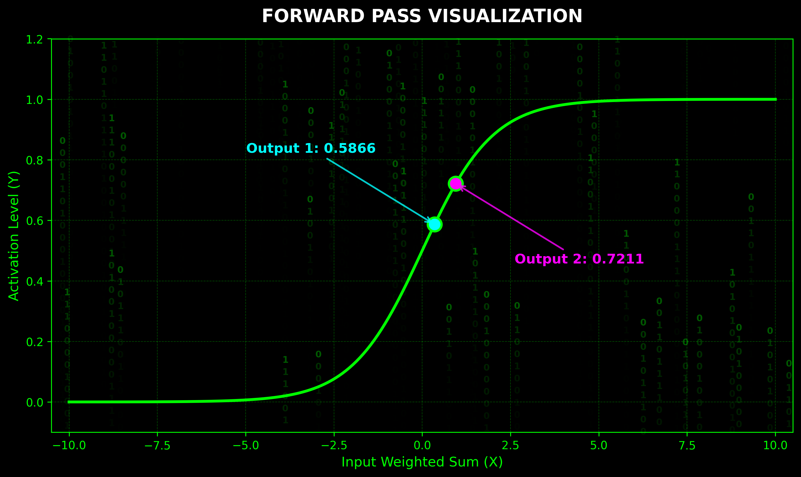

# 🧠 Neural Network Forward Pass: Matrix Inference Visualizer

[]()
[]()

> *An interactive, code-driven exploration of neural network signal propagation and non-linear activation spaces.*

## 📖 Abstract

This repository presents a specialized visualization environment designed to demystify the **forward pass mechanics** of a multi-layer perceptron (MLP). Moving beyond abstract mathematical notation, this project maps precise tensor operations (weighted sums) directly onto a continuously differentiable activation space (the Sigmoid curve). 

The visualization is wrapped in a custom, procedurally generated "Matrix" cyberpunk aesthetic, serving both an educational and presentational purpose.

## 🔬 Methodology & Inspiration

The mathematical foundation and pedagogical approach of this project are heavily inspired by **Tariq Rashid's** seminal work on neural networks. 

Following Rashid's philosophy of "understanding the matrix math under the hood," this project explicitly visualizes the transition from discrete inputs and synaptic weights to the final continuous output. By mapping specific, manually calculated weighted sums ($X_1 = 0.35$, $X_2 = 0.95$) to their precise activation thresholds ($Y_1 \approx 0.5866$, $Y_2 \approx 0.7211$), we bridge the gap between abstract calculus and geometric intuition.

## 🧮 Core Architecture

1.  **Inference State:** Precise modeling of a 2-node hidden layer forward pass.
2.  **Activation Function:** Application of the standard logistic sigmoid function: $\sigma(x) = \frac{1}{1 + e^{-x}}$
3.  **Visual Engine:** A custom Matplotlib pipeline featuring:
    * Procedurally generated, dimmed binary code rain (`#008000` alpha gradients).
    * Collision-proof, mathematically annotated data points using vector arrows.
    * High-contrast neon color mapping for cognitive clarity.



## 🚀 Quick Start / Reproduction

```bash
# Clone the repository
git clone [https://github.com/yourusername/nn-forward-pass-viz.git](https://github.com/yourusername/nn-forward-pass-viz.git)

# Install necessary scientific libraries
pip install matplotlib numpy

# Execute the visualization environment
python forward_pass_viz.py
📸 Experimental Results
(Fig 1. Geometric mapping of hidden layer neuron activations plotted against the global sigmoid space.)

Developed as part of an advanced exploration into Neural Network fundamentals, linear algebra, and data visualization techniques.

## Author & Contribution

This research, the underlying codebase, and the visualization logic were developed entirely by **Dariia Zhdanova**. 

The project serves as a comprehensive demonstration of applying mathematical theory (as outlined by Tariq Rashid) into a functional, high-fidelity digital asset.

---
*Developed by Dariia Zhdanova | 2026 | Neural Network Research Series*
